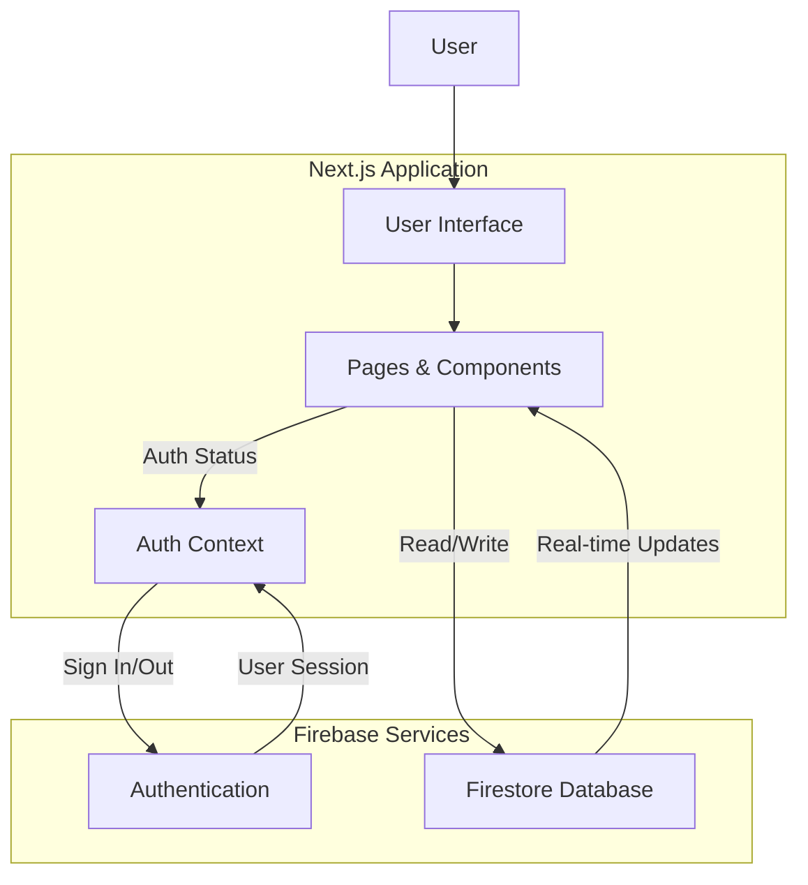
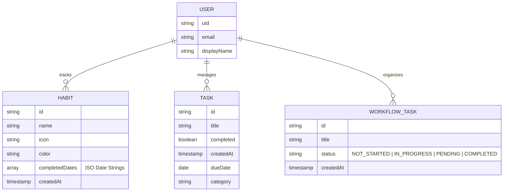
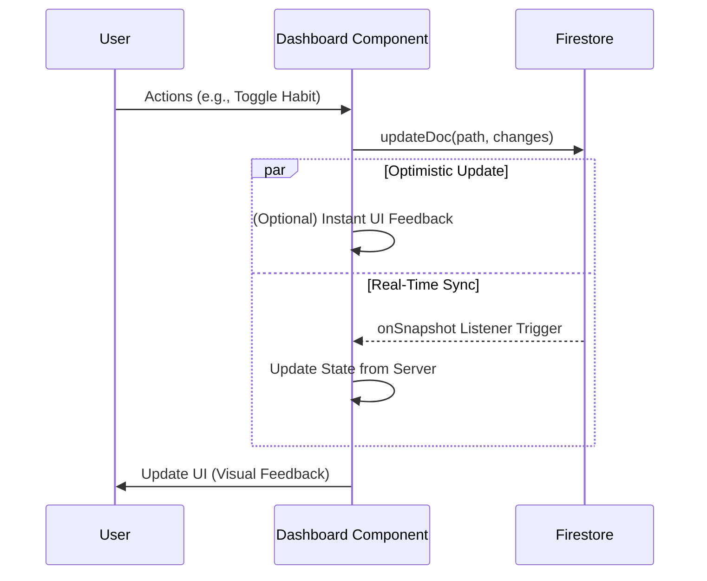

# Project Documentation: Habit Tracker

## 1. Project Overview
A modern Habit Tracker application built with Next.js and Firebase, designed to help users organize their daily routines and tasks. The application focuses on a seamless user experience with rich animations and intuitive state management.

## 2. Technology Stack

### Frontend Core
- **Next.js 16 (App Router)**: Utilized for its robust server-side rendering, routing capabilities, and latest React 19 integration.
- **TypeScript**: Ensures type safety across the application, reducing runtime errors and improving developer experience through interfaces and strict typing.
- **React 19**: The underlying UI library for building component-based interfaces.

### Styling & UI
- **Tailwind CSS 4**: A utility-first CSS framework used for styling components efficiently.
- **Framer Motion**: Implemented for smooth animations and transitions (e.g., page transitions, component mounting).
- **Lucide React**: Provides a consistent set of SVG icons.
- **clsx / tailwind-merge**: Utilities for dynamically constructing class names without conflicts.

### State Management
- **Zustand**: A small, fast state management solution. Used here for managing:
  - `habits`: List of user habits.
  - `tasks`: Daily tasks.
  - State persistence (saving to local storage).
  - *Note: The core application currently interacts directly with Firestore for real-time data implementation, bypassing the store for the main Dashboard and Workflow features.*
- **React Context API**: Used specifically for `AuthContext` to manage and distribute the user's authentication state (User object, loading state) throughout the component tree.

### Backend & Services
- **Firebase Authentication**: Handles secure user sign-up, sign-in, and session management.
- **Firebase Firestore**: A NoSQL cloud database for storing user data (configured in `src/lib/firebase.ts`).

### Additional Libraries
- **@hello-pangea/dnd**: Provides drag-and-drop capabilities for reordering items in the workflow.
- **canvas-confetti**: Adds visual feedback (confetti) for user achievements (e.g., completing a task).
- **recharts**: Installed for potential data visualization (charts/graphs) of habit progress.

## 3. Object-Oriented Programming (OOP) Concepts
While the application is primarily built using Functional Programming (FP) paradigms typical of React, several OOP concepts are utilized:

- **Encapsulation**: 
  - Components (e.g., `AuthProvider`) encapsulate specific logic and state, exposing only what is necessary to children via Context.
  - The `firebase.ts` module encapsulates the initialization and configuration of the Firebase app, exposing only the service instances (`auth`, `db`).

- **Abstraction & Interfaces**:
  - TypeScript Interfaces (`Habit`, `Task`, `AuthContextType`) abstract the data models, defining the contract for objects used within the application.
  - Example: `HabitStore` interface defines the methods and properties the store must implement.

- **Singleton Pattern**:
  - The Firebase service instances (`auth`, `db`) in `src/lib/firebase.ts` act as Singletons, ensuring only one instance of the service is created and shared across the application.

## 4. Data Structures
The application relies on efficient data structures to manage state:

- **Arrays (`Array<T>`)**:
  - **Usage**: Heavily used for collections. `habits: Habit[]` stores the list of habits. `tasks: Task[]` stores tasks.
  - **History**: `completedDates` within a `Habit` object is an array of date strings to track the habit's completion history.
  
- **Objects**:
  - **Usage**: The central data entities (`Habit`, `Task`) are modeled as Objects with properties like `id`, `name`, `streak`, etc.
  - **Configuration**: Constants like `firebaseConfig` use simple objects to store key-value configuration data.
  
- **JSON**:
  - Used for persisting state to Local Storage (via Zustand persistence) and for data exchange.

## 5. Development & Infrastructure
- **Docker**: The project includes a `Dockerfile`, enabling containerized deployment (e.g., to Google Cloud Run).
- **ESLint**: Integrated to ensure code quality and consistency across the codebase.

## 6. System Design And Architecture

### High-Level Architecture
The application uses a serverless architecture leveraging Firebase for backend services. The frontend allows for real-time updates through Firestore listeners.

### Entity Relationship Diagram (ERD)
The NoSQL data structure is modeled as collections under each user document to ensure data isolation.

### Data Flow & Real-Time Synchronization
The application focuses on Optimistic UI where possible, but primarily relies on Firestore's `onSnapshot` for maintaining truth.

